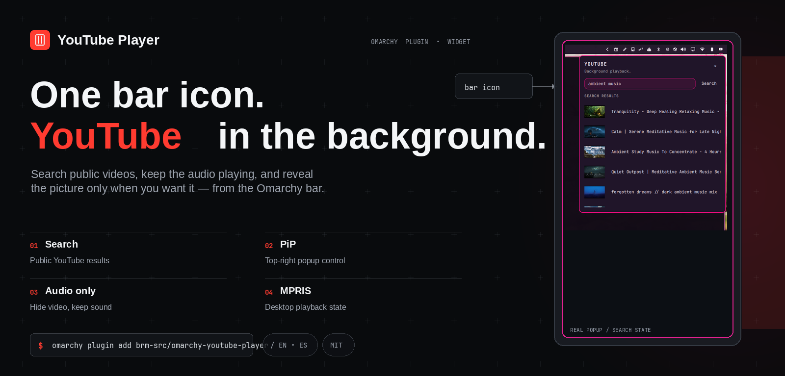
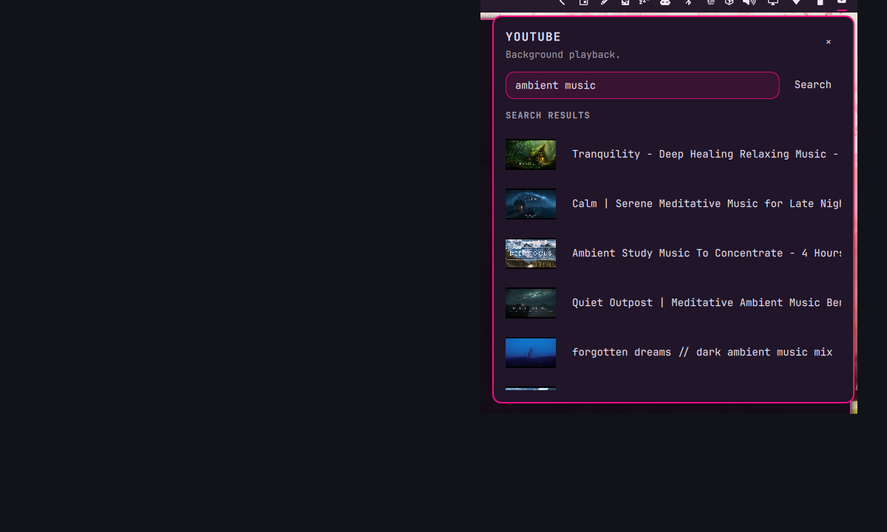
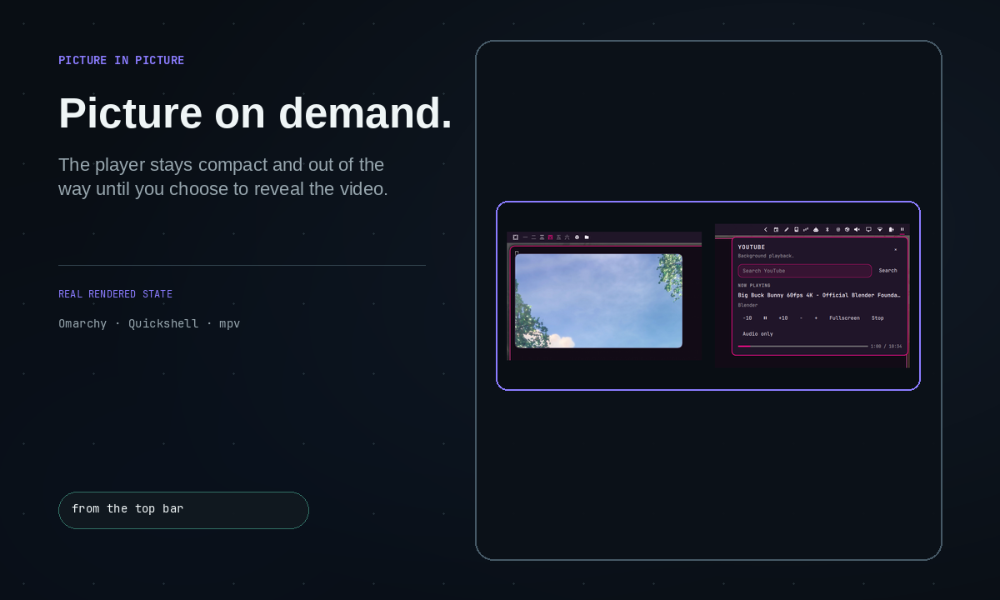
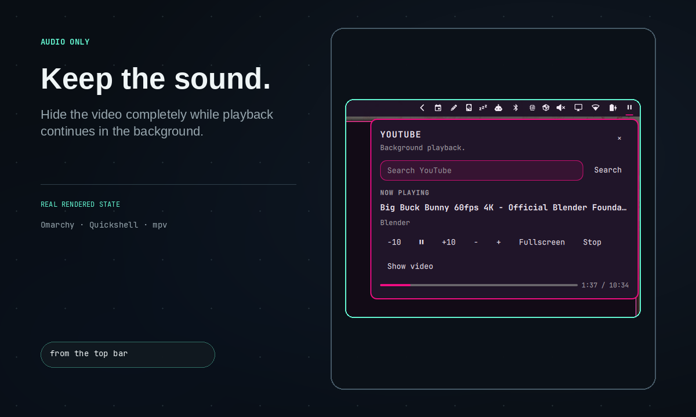

# YouTube Player for Omarchy

A compact YouTube player for the Omarchy bar.



## Screenshots





## What it does

YouTube Player keeps public YouTube playback close to the desktop without turning the bar into a media dashboard:

- search YouTube from a compact Omarchy popup;
- play a public video in `mpv` while other applications stay usable;
- keep playback running when the popup closes;
- expose title and playback state through the native MPRIS ecosystem;
- open a deliberate 480x270 always-on-top PiP window without stealing focus;
- toggle fullscreen from the popup when a larger view is wanted;
- use the system language for user-facing copy: English or Spanish.

The current release is intentionally URL-first and unauthenticated. It saves only the last public video metadata locally. It does not read browser cookies, request Google OAuth, download videos, proxy YouTube, or ship an ad blocker.

Direct stream resolution is not a guarantee of ad-free playback. YouTube playback, availability, authentication, and advertising behavior remain controlled by YouTube. When direct playback fails, open the canonical URL in a normal browser.

## Requirements

- Omarchy with Quickshell plugins
- `mpv`
- `yt-dlp`
- `ffmpeg`
- `mpv-mpris` is recommended for MPRIS metadata and controls

No sudo or pkexec is required.

## Install

```bash
omarchy plugin add https://github.com/brm-src/omarchy-youtube-player.git --enable --yes
omarchy restart shell
```

The plugin manager installs the repository and enables the bar widget. It does not install system packages. Install the requirements with your distribution package manager if they are missing.

To add the widget to a bar section:

```bash
omarchy bar put io.github.brm-src.omarchy-youtube-player --section right
omarchy restart shell
```

For deterministic English screenshots and QA, regardless of the machine locale:

```bash
hyprctl eval 'hl.env("OMARCHY_YOUTUBE_PLAYER_LANG", "en")'
omarchy restart shell
```

Omit that environment variable to use the system language.

## Use

- Click the bar icon in the top-right bar to open the anchored player popup.
- Search for a video, then select a result.
- Playback continues in the background in a small PiP window without capturing the mouse or keyboard focus.
- Press `Escape` or click outside the popup to close it.
- Use the popup controls for pause, seek, volume, fullscreen, and `Audio only`.
- `Audio only` disables the video track and minimizes the PiP window while audio continues.
- Use `Show video` to restore the PiP window, or `Stop` to end playback.

The direct IPC target is:

```bash
omarchy-shell io.github.brm-src.omarchy-youtube-player open
omarchy-shell io.github.brm-src.omarchy-youtube-player close
omarchy-shell io.github.brm-src.omarchy-youtube-player toggle
```

## Remove

```bash
python3 ~/.config/omarchy/plugins/io.github.brm-src.omarchy-youtube-player/player.py action quit --lang en
omarchy plugin remove io.github.brm-src.omarchy-youtube-player --yes
omarchy restart shell
```

The command disables the plugin, removes it from the Omarchy plugin registry, and deletes the installed plugin files. Playback state is stored separately under `$XDG_STATE_HOME/omarchy-youtube-player`; remove that directory only if you also want to delete the local last-video metadata.

## Privacy and scope

Search and metadata requests go directly to YouTube through `yt-dlp`. The plugin does not send data to a third-party backend. Search terms and URLs are visible to YouTube and the network providers involved in the request.

This plugin is not affiliated with YouTube, Google, or Omarchy. Respect YouTube's Terms of Service, copyright, and the rights of creators.

## Development checks

```bash
python3 -m unittest discover -s tests -q
python3 -m py_compile player.py
qmllint -I /usr/share/omarchy/shell Widget.qml
omarchy plugin validate .
git diff --check
```

## License

MIT. See [LICENSE](LICENSE).
